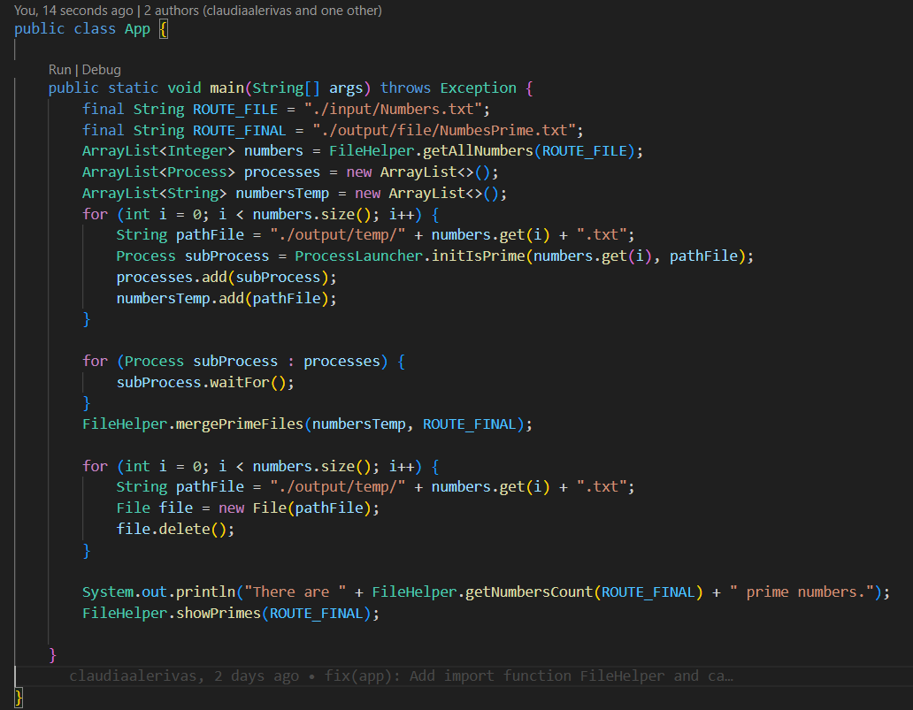

## CLASES EJECUTABLE

### App

En la clase App, se ejecuta el flujo compreto del programa. 

### Funcionalidad
- Leer una lista de números proporcionada desde un archivo de entrada llamado Numbers.txt

- Lazar un subproceso de manera concurrente por cada número que determina si es primo o no. El resultado de cada subprocesos de guarda en un archivo temporal.

- LLama a una función que fuciona los archivos temporal con el archivo final.

- Elimina los archivos temporales.

- LLama a funciones que muestran por consola la cantidad de números primos que hay y cuales son.

---
### Detalles
- ROUTE_FILE es la ruta del archivo de entrada que contiene los números.

- ROUTE_FINAL es la ruta del archivo donde se almacenarán los números primos.

- Usa la clase FileHelper para la lectura de números, fusión de archivos y manejo de conteo

- Usa la clase ProcessLauncher para levantar subprocesos encargados de verificar si un número es primo.

---
- Regresar _**Manual del programa**_ [<<**aquí**>>](MANUAL_PROGRAMA.md) 