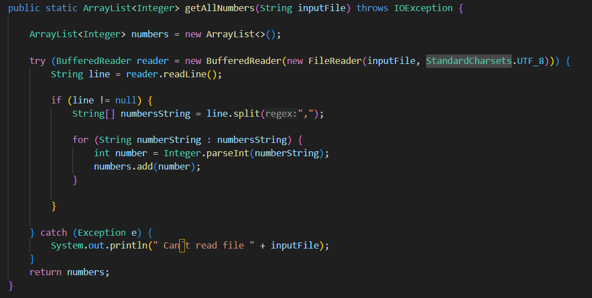
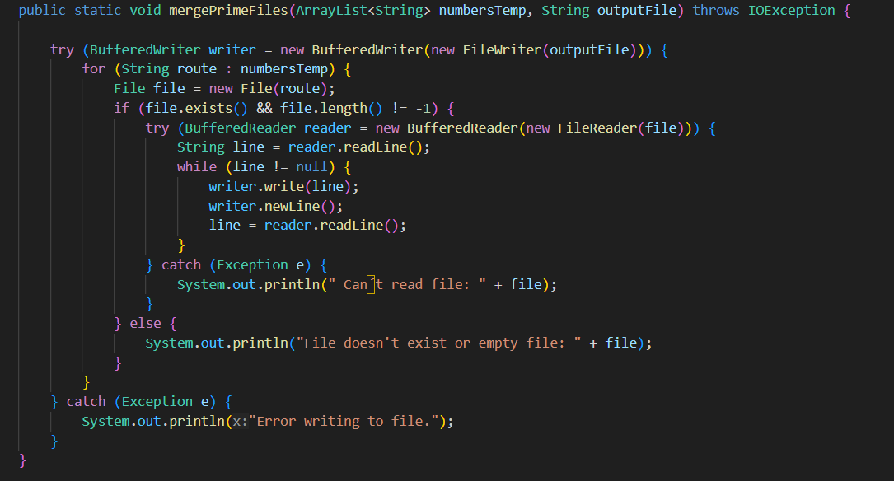
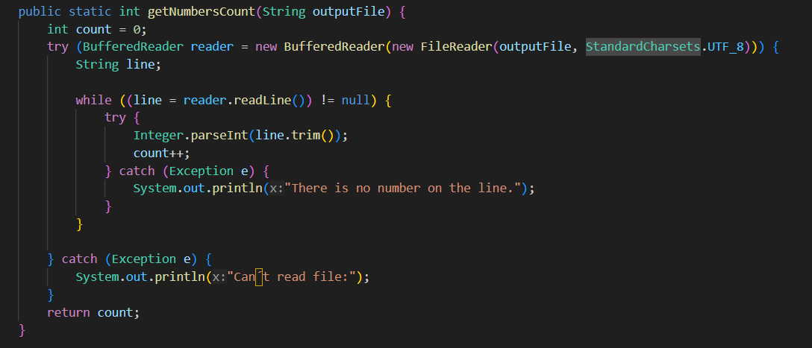
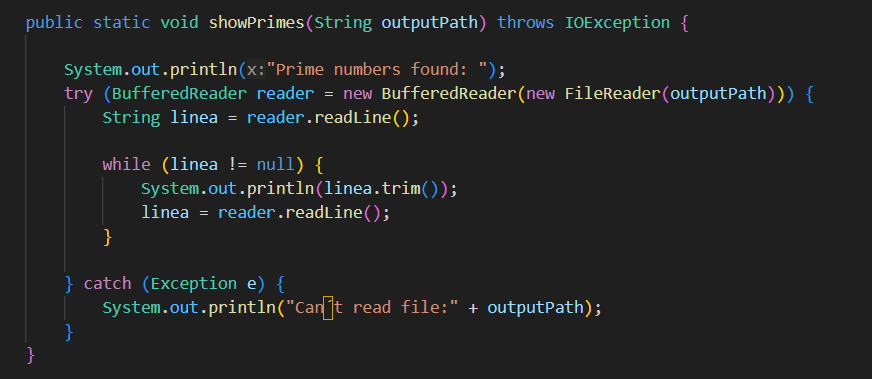

## Clase ProcessLauncher

Proporciona funciones utilitarias para la manipulación de archivos. Realiza tareas como leer números de un archivo, fusionar archivos que contienen los números primos, contar los números en un archivo y mostrar los números primos.

### Método
- **getAllNumbers(String inputFile)**
Lee todos los números de un archivo de texto (Numbers.txt) y los convierte en una lista de enteros.

##### Funcionalidad
- Separa los números por comas.
- Maneja excepciones.

- **mergePrimeFiles(ArrayList<String> numbersTemp, String outputFile)**
Combina los archivos temporales que contienen números primos en un solo archivo final

##### Funcionalidad
Lee cada archivo temporal y escribe su contenido en el archivo final.

- **getNumbersCount(String outputFile)**
Cuenta cuántos números hay en el archivo de salida que contiene los números primos.

- **showPrimes(String outputPath)**
Imprime en la consola todos los números primos que se han encontrado.

---
- Regresar _**Manual del programa**_ [<<**aquí**>>](MANUAL_PROGRAMA.md) 