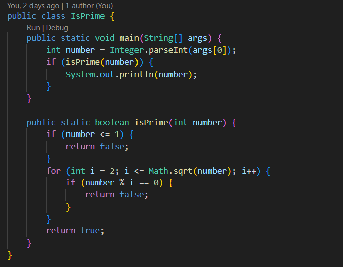

## Clase IsPrime

Esta clase determina si un número es primo.

### FUNCIONES

- **isPrime(int number)**
Función boolenana que retorna TRUE o FALSE dependiendo si un número pasado como argumento es primo o no.

---
- Regresar _**Manual del programa**_ [<<**aquí**>>](MANUAL_PROGRAMA.md) 