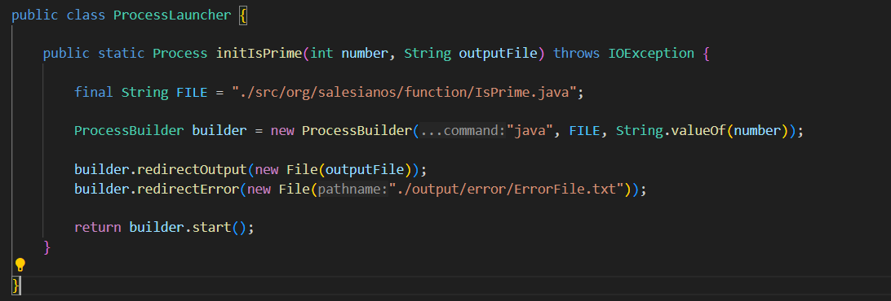

## Clase ProcessLauncher

 Esta clase incia los subprocesos que se encargan de verificar si un número es primo. Para cada número, se lanza un proceso que ejecuta un archivo Java (en este caso, IsPrime.java), el cual determina si el número es primo.

### Método
- **initPrime(int number, String outputFile)**
 Inicia un subproceso que ejecuta el programa IsPrime.java con el número a evaluar y redirige la salida a un archivo especificado.

### Detalles
La salida del proceso se guarda en archivos temporales, y cualquier error se redirige a un archivo llamado ErrorFile.txt.

---
- Regresar _**Manual del programa**_ [<<**aquí**>>](MANUAL_PROGRAMA.md) 