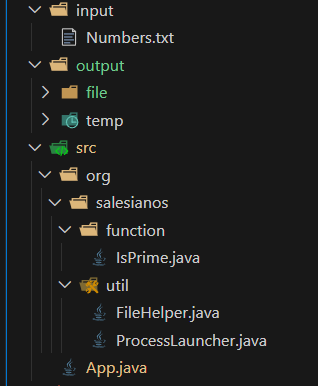

# Documentación del programa

_**Claculo números primos**, es un programa que trabaja con procesos independientes para resolver tareas en paralelo, específicamente con el calculo de números primos que se encuentran dentro de un fichero .txt que contiene números ramdon_

---
## ESTRUCTURA DEL CÓDIGO
El código fuente del proyecto está organizado de la siguiente manera:

---
### CLASES EJECUTABLE
- Encuentra la clase _**Ejecutable**_ [<<**aquí**>>](CLASE_EJECUTABLE.md) 

## FUNCIONES
- Encuentra la clase _**IsPrime**_ [<<**aquí**>>](CLASE_IS_PRIME.md) 
---
### CLASES UTILARIAS
- Encuentra la clase _**FileHelper**_ [<<**aquí**>>](CLASE_FILE_HELPER.md) 

- Encuentra la clase _**ProcessLauncher**_ [<<**aquí**>>](CLASE_PROCESS_LAUNCHER.md) 